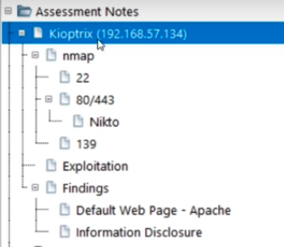
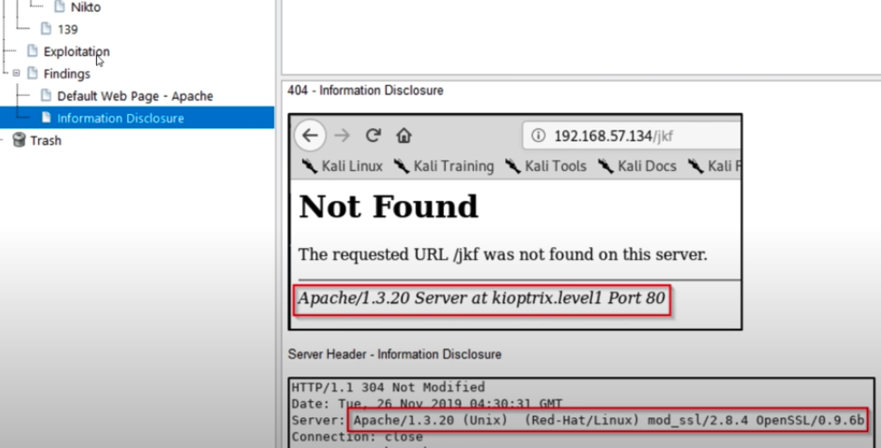

kioptrix hack machine is on: 192.168.129.130
while scanning is going on, other OSINT tasks can be done (parallel, like in cooking)

arp-scan -l
replacement to netdiscover (look for vmware and self)

nmap (network mapper)
gets picked up on 20% of networks (only on good security) stealth: not really
only performs: SYN >< SYNACK >< RST (reset, just kidding)
it reveals that the port is open/available, we don't make connections

nmap -T4 -p- -A
-T4: speed, 1 slow / 5 fast (slower better in terms of detection, throttled)
-p-: scan _all_ ports (without this, scans 1k most common ports, total 65,535) (or -p 80,443,53)
-A: version info, OS info, fingerprinting > all the info

nmap --help (study this)
-sn: Ping scan
-Pn: treat all hosts as online
-sU: UDP scan (connection-less > 65k ports, very slow to scan)

you can skip -A to go faster, and then do it specifically on ports that interest you

---

Port 135 is used for RPC client-server communication; ports 139 and 445 are used for authentication and file sharing. UDP ports 137 and 138 are used for local NetBIOS browser, naming, and lookup functions.
SMB, CIFS, and NetBIOS

The Server Message Block (SMB) protocol can facilitate resource sharing in Microsoft Windows environments. Under Windows NT, SMB is run through NetBIOS over TCP/IP, which uses UDP ports 135, 137, and 138 along with TCP ports 135 and 139. With Windows 2000, Microsoft added CIFS support, which provides full SMB access directly through TCP and UDP port 445 (as opposed to using a variety of UDP and TCP ports). Many system administrators diligently filter access to ports between 135 and 139, but have been known to neglect port 445 when protecting Windows 2000 hosts.

---

think of point of attack as an attacker
commonly found ports with exploits, historically (low hanging fruit, juiciest)
i.e. 80, 443, 139 are common; ssh (22) is not
hygiene of the target (good/bad)
information disclosure (versions, hostnames, non-existent dirs/files)

---
webapp scan:
version info, backend dirs, source code, vulnerability scanning, general info

web (80/443)
* many websites?
* directories?

nikto: web vulnerability scanner
might get blocked by firewalls/sec, use based on hunch of tightness
nikto -h https://host

protection tags are important for a webapp pentest
notate on reports _very_ outdated software
DoS is out of scope for a pentest
overflow and rewrite (remote, not local) are interesting

dirbuster: directory busting
alternatives: dirb, gobuster
/usr/share/wordlists (list of directories/files to navigate to)
run php,txt,zip,rar,pdf,docx (makes it slower)

remember to check html source code (comments, keys, info disclosure)

burpsuite
repeater: modify requests by hand
target > scope: limit (filter) overall requests to specific targets 

---
SMB scan: file sharing
check nmap for SMB version info

try to connect and see if there's malicious stuff or we can do malicious stuff
msfconsole: search smb
auxiliary/scanner/smb/smb_version > for version info

smbclient -L \\host
connect to the fileshare, list shares
try with anonymous login to check for files

smbclient \\\\host\\share
once on console > "help"

---
SSH
connect to see version
when we attempt to login, we'll do exploit
looking for a welcome banner with more info (version, company, etc)

if no algo matches, then:
ssh host -oKexAlgorithms=+algo
and then
ssh host -oKexAlgorithms=+algo -c cypher

---
researching vulnerabilities
grab service/version, lookup in google +exploit
when looking at CVE, pay attention to score (red is best, critical)
exploit-db or rapid7 (makers of metasploit)

searchsploit: cli lookup vulns

---
notes example:

full dumps or versions under each item
on "default webpage", screenshot of the website
on "info disclosure", also screenshots of versions/info disclosed

borders on images, red highlight on info that's important
write for someone else to understand the notes

---
nessus: vulnerability scanner, extra layer of assesment
schedule can be good as a business model (repeat every X days)
report on most relevant, if a lot of high then not so much lows 
download .nessus file, can convert to xls and deliver fully

basic network scan
discovery: all ports
assesment: all quick

advanced scan
