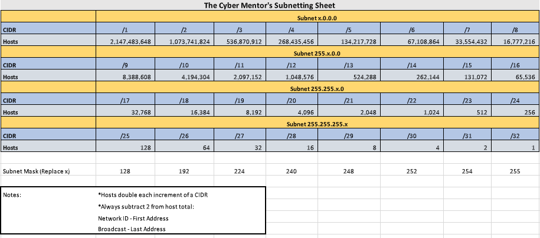

https://www.youtube.com/watch?v=fNzpcB7ODxQ

- IP addresses
- MAC addresses
- TCP, UDP, and the 3-way handshake
- common ports and protocols
- the OSI model
- subnetting

**IP addresses (layer 3 protocols > routing traffic)**
v4 > 4 octets = 4 bytes = 32 bits
v6  > 128 bytes

NAT = network address translation

**MAC addresses - media access control (layer 2 protocols > switching (physical address))**
on ifconfig "ether"
first 3 pairs identify maker > ether ==3c:22:fb==:28:66:59

**TCP, UDP, and the 3-way handshake (layer 4 transport)**
transmission control protocol: conn oriented
reliability: http, ftp, ssh

3 way handshake: \[SYN\] > \[SYN ACK\] > \[ACK\]
port: item (maybe) open in a machine, way to communicate with protocols (65,000+)

user datagram protocol: connless protocol
streaming, dns, voip

**common ports and protocols**

**the OSI model**
please do not throw sausage pizza away
1 Physical - data cables, cat6 (plug in)
2 Data - switching, MAC addresses
3 Network - IP addresses, routing
4 Transport - TCP/UDP
5 Session - session management
6 Presentation - WMV, JPEG, MOV (media)
7 Application - HTTP, SMTP

**subnetting**
255.255.255.0 = /24 network (slash twenty-four - household & small biz) 2^8 hosts (256)
24 is for bits switched on all(8).all(8).all(8).none(0) = 24

https://drive.google.com/file/d/1ETKH31-E7G-7ntEOlWGZcDZWuukmeHFe/view

https://www.ipaddressguide.com/cidr

192.168.0.0/22
subnet = 255.255.252.0
hosts = 1,022
network = 192.168.0.0
broadcast = 192.168.3.255 ==(uneven?)==

192.168.1.0/26
subnet = 255.255.255.192
hosts = 62
network = 192.168.1.0
broadcast = 192.168.1.63

192.168.1.0/27
subnet = 255.255.255.224
hosts = 30
network = 192.168.1.0
broadcast = 192.168.1.31